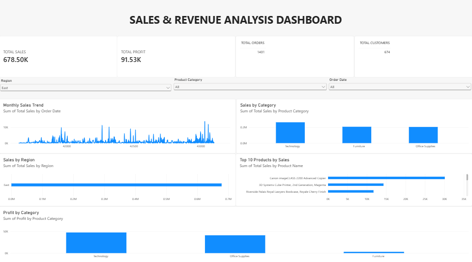

# sales-revenue-analysis-dashboard
Sales and Revenue Analysis Dashboard built using Power BI.

# Project Overview

The **Sales & Revenue Analysis Dashboard** is an interactive business intelligence dashboard developed using **Microsoft Power BI**. The dashboard provides a clear overview of sales, profit, orders, customers, product performance, and category-level performance.

The purpose of this dashboard is to help analyze sales performance and identify important business trends and patterns through interactive visualizations and filters.

---

# Project Objective

The main objective of this project is to analyze sales and revenue data and transform it into meaningful business insights using Power BI.

The dashboard helps users:

- Monitor overall sales and profit performance
- Track the number of orders and customers
- Analyze sales trends over time
- Compare sales performance across product categories
- Identify top-performing products
- Compare regional sales performance
- Analyze profit performance by product category
- Interactively filter the dashboard using slicers

---

# Tools & Technologies

- **Microsoft Power BI**
- **Power Query** for data preparation and transformation
- **DAX** for calculations and measures
- **CSV Dataset** as the data source

---

# Dashboard KPIs

The dashboard provides the following key performance indicators:

| KPI             | Value   |
|---------------- |-------- |
| Total Sales     | 678.50K |
| Total Profit    | 91.53K  |
| Total Orders    | 1,401   |
| Total Customers | 674     |

These KPIs provide a quick overview of the overall business performance.

---

# Dashboard Visualizations

# 1. Monthly Sales Trend

A line chart is used to visualize sales performance over order dates. This helps identify fluctuations and changes in sales over time.

# 2. Sales by Category

A column chart compares total sales across different product categories:

- Technology
- Furniture
- Office Supplies

Technology currently shows the highest sales among the displayed categories.

# 3. Sales by Region

A bar chart displays sales performance by region. The dashboard currently has the **East** region selected through the Region slicer.

# 4. Top 10 Products by Sales

A horizontal bar chart displays the top-performing products based on total sales. This helps identify products that contribute significantly to overall sales.

# 5. Profit by Category

A column chart compares profit across product categories. Technology shows the strongest profit performance among the displayed categories, while Furniture has comparatively lower profit.

---

# Interactive Filters

The dashboard includes interactive slicers that allow users to filter and explore the data.

# Region
Allows users to analyze performance for a specific region.

# Product Category
Allows users to filter the dashboard by product category.

# Order Date
Allows users to analyze sales performance for a selected date or date range.

The charts and KPI values update based on the selected filters, enabling interactive analysis.

---

# Key Business Insights

Based on the current dashboard view:

- Total sales are **678.50K**.
- Total profit is **91.53K**.
- The dashboard contains **1,401 orders** and **674 customers**.
- **Technology** currently has the highest sales among the displayed product categories.
- **Technology** also shows the strongest profit performance among the displayed categories.
- The Top 10 Products visual helps identify products with the highest sales contribution.
- Sales show variations across different order dates.
- Interactive slicers allow users to explore sales performance by region, category, and order date.

> Note: The displayed insights change when different slicer selections are applied.

---

# Dashboard Features

- Interactive KPI cards
- Sales and profit analysis
- Sales trend analysis
- Category-wise sales comparison
- Regional sales analysis
- Top 10 product analysis
- Category-wise profit analysis
- Interactive slicers
- Business insight generation

---

 # Dashboard Preview

---

 # Project Files

- `Sales_Revenue_Analysis_Dashboard.pbix` — Power BI dashboard file
- `Sales_Revenue_Analysis_Dashboard.png` — Dashboard preview
- `README.md` — Project documentation

---

# Conclusion

The **Sales & Revenue Analysis Dashboard** provides an interactive and visual approach to understanding sales and revenue performance. By combining KPIs, charts, and interactive filters, the dashboard enables users to quickly identify important sales trends, category performance, regional performance, product performance, and profitability patterns.

This project demonstrates practical skills in **Power BI, data visualization, business intelligence, data analysis, and dashboard development**.
